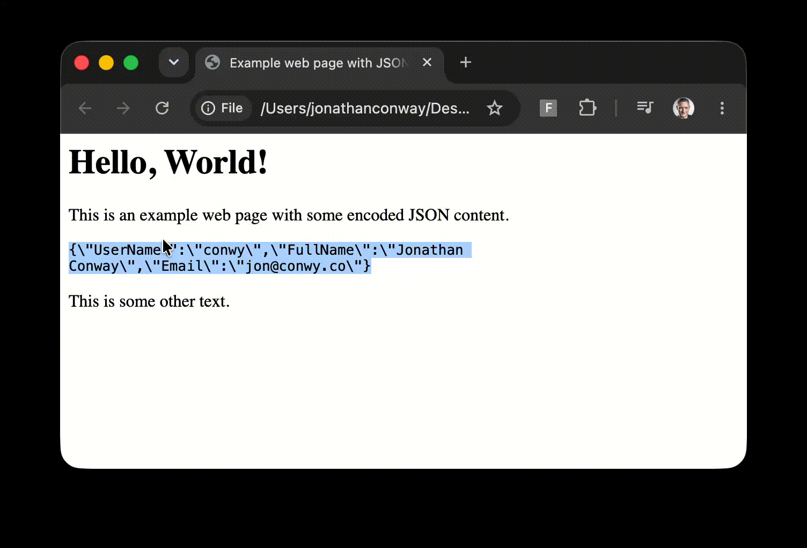

# json-selection-formatter

Chrome extension that unescapes, formats and syntax-highlights any piece of JSON selected in a web page.

## Installation (General usage)

1. Go to [Format Selected JSON](https://chromewebstore.google.com/detail/format-selected-json/fnkpkdgghhniojemjaefijfdfenabmbe) in the [Chrome Web Store](https://chromewebstore.google.com/).
2. Click Add to Chrome

## Installation (Local, for development)

1. Clone the solution to a local `json-selection-formatter` repo folder.
2. Go to chrome://extensions.
3. Turn on Developer mode (top right).
4. Click Load unpacked and choose the `json-selection-formatter` repo folder.

## Usage

Simply select a piece of JSON in the browser window, right click, then click **Format selected JSON**.

The formatted JSON will open in a new browser tab, in a more readable format, with a convenient Copy button.

<table>
<tr>
<td>

</td>
<td>

</td>
</tr>
</table>

## Credits

Vibe coded with Claude Code Opus 5.5.

### Prompt history

Prompt: Is there a browser extension that allows me to select any region of a page that is JSON and formats it nicely (unescaping, indentation, syntax highlighting, etc) and shows it to me?

AI response:

Probably, but I can't name one I'm confident does exactly this. The well-known extensions mostly format a whole page, not a selected region:

- JSON Formatter (Chrome) and JSON Viewer only kick in when the whole response is JSON, such as when you open an API URL directly.
- Firefox has a built-in JSON viewer with the same limitation.

There are smaller extensions that format selected text from the right-click menu, but I don't want to guess their names. I can search the Chrome Web Store or Firefox Add-ons for current ones if you'd like.

A bookmarklet does this with no extension. Create a bookmark, paste this as its URL, then select some JSON on any page and click the bookmark:

javascript:(()=>{let s=String(getSelection()).trim();let v;try{v=JSON.parse(s);while(typeof v==='string')v=JSON.parse(v)}catch(e){try{v=JSON.parse(JSON.parse('"'+s.replace(/^"|"$/g,'')+'"'))}catch(e2){alert('Not valid JSON: '+e.message);return}}const esc=t=>t.replace(/&/g,'&amp;').replace(/</g,'&lt;');const h=esc(JSON.stringify(v,null,2)).replace(/("(\\.|[^"\\])_")(\s_:)?|\b(true|false|null)\b|-?\d+(\.\d+)?([eE][+-]?\d+)?/g,(m,str,\_,colon,kw)=>{let c=str?(colon?'#9cdcfe':'#ce9178'):kw?'#569cd6':'#b5cea8';return''+m+''});const w=open('','\_blank');w.document.write('<body style="background:#1e1e1e;color:#d4d4d4;margin:0"><pre style="font:13px monospace;padding:16px;white-space:pre-wrap">'+h+'</pre>')})()

It:

- Unescapes: it handles JSON stored as a string, like "{\"a\":1}", or escaped text like {\"a\":1}, and keeps parsing until it reaches an actual object.
- Formats: it indents by 2 spaces and opens the result in a new tab.
- Highlights: keys, strings, numbers and true/false/null get VS Code-style dark-theme colours.

Limitations:

- Pages with a strict Content Security Policy (GitHub, for example) block bookmarklets.
- Selecting text from code blocks with line numbers can pick up stray characters.

I can also turn this into a small unpacked Chrome extension with a right-click "Format selected JSON" menu item, which works on those strict-policy sites too.

Prompt: I got this error in the Javascript snippet: <error>. Can you help me fix it?.

AI response:

Fixed version below. In the error message, \b(true has become \b true, so the ( was lost somewhere between my message and your bookmark. My guess is the copy-paste or the bookmark editor mangled it. The new version avoids the characters most likely to cause that. It removes the \b before (, which it didn't need anyway. It also uses colour names instead of # hex codes, because some browsers treat # in a bookmark URL as the start of a page anchor.

javascript:(()=>{let s=String(getSelection()).trim();let v;try{v=JSON.parse(s);while(typeof v==='string')v=JSON.parse(v)}catch(e){try{v=JSON.parse(JSON.parse('"'+s.replace(/^"|"$/g,'')+'"'))}catch(e2){alert('Not valid JSON: '+e.message);return}}const esc=t=>t.replace(/&/g,'&amp;').replace(/</g,'&lt;');const h=esc(JSON.stringify(v,null,2)).replace(/("(?:\\.|[^"\\])_")(\s_:)?|(true|false|null)|-?\d+(?:\.\d+)?(?:[eE][+-]?\d+)?/g,(m,str,colon,kw)=>{let c=str?(colon?'lightskyblue':'sandybrown'):kw?'cornflowerblue':'darkseagreen';return''+m+''});const w=open('','\_blank');w.document.write('<body style="background:rgb(30,30,30);color:gainsboro;margin:0"><pre style="font:13px monospace;padding:16px;white-space:pre-wrap">'+h+'</pre>')})()

The other changes are:

- The groups that don't need capturing are now (?:...), so the replace callback only receives the string, the colon and the true/false/null keyword.
- I dropped the \b word boundaries around true/false/null. The regex reads each quoted string as a whole first, so these words can only match outside strings, where they're real values.

I haven't run this updated version. If it still errors, paste the new message and check whether any other characters have changed in the saved bookmark.

Prompt: Turn this into a small unpacked Chrome extension with a right-click "Format selected JSON" menu item, which works on those strict-policy sites too.

AI response:

I've built the extension in ~/json-selection-formatter. It passes a syntax check, and the JSON parsing works on plain, string-wrapped and escaped JSON. I haven't loaded it in Chrome, so please try it there.

To install:

1. Go to chrome://extensions.
2. Turn on Developer mode (top right).
3. Click Load unpacked and choose the ~/json-selection-formatter folder.

Then select some JSON on any page, right-click, and choose Format selected JSON. A new tab opens next to the current one with the formatted result.

It works on strict-policy sites like GitHub because it never runs code on the page. The right-click menu passes the selected text to the extension, and the result is shown on the extension's own page, which the site's security policy doesn't affect. It only needs the contextMenus and storage permissions and has no access to page content.

Compared with the bookmarklet:

- There's a Copy button for the formatted JSON.
- It uses light or dark colours to match your system theme.
- If the text isn't valid JSON, it shows the error along with the original text.

Files:

- manifest.json: the extension's settings and permissions.
- background.js: adds the menu item, saves the selection, and opens the viewer tab.
- viewer.html, viewer.js, viewer.css: the page that parses, formats and colours the JSON.

The selected text is kept only in Chrome's temporary storage. If you restart Chrome, refreshing an old viewer tab will say the selection wasn't found.

