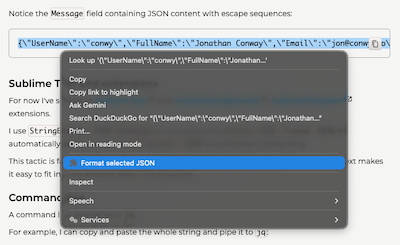
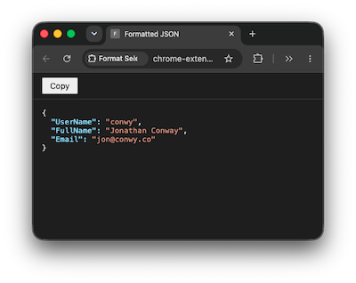

# json-selection-formatter

Unescape and format selected JSON - Chrome bookmarklet.

## Installation

## Usage

Simply right click some JSON in the browser window and click **Format selected JSON**.

<table>
<tr>
<td>

</td>
<td>

</td>
</tr>
</table>

## Prompts

Unescape and format JSON selected in browser page - Chrome bookmarklet.

Vibe coded with Claude Code Opus 5.5.
